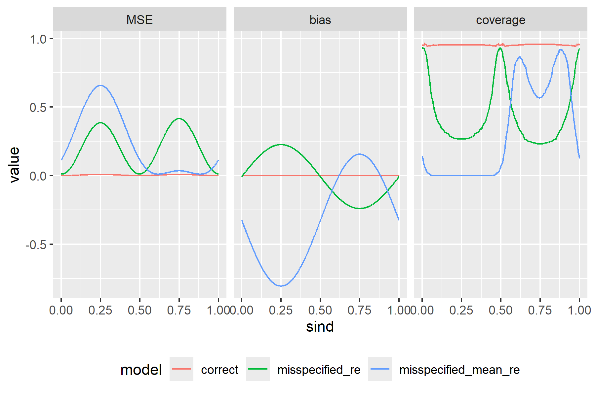

# Method

The day-of-year variable was rescaled to range between 0 and 1, and this rescaled variable was named \(s\). Subsequently, \( \sin(2\pi s) \) and \( \cos(4\pi s) \) were calculated and added to the dataset as new variables.


A generalized mixed Poisson model with only a random slope was fitted to account for seasonal variation in the minutes of MVPA (moderate to vigorous physical activity) among participants. The predictors included the rescaled day-of-year variable (\(s\)), the treatment indicator, and their interaction. The random slope term incorporated \( \sin(2\pi s) \) and \( \cos(4\pi s) \).

Using the coefficients of the fixed effects and the variance-covariance matrix from the random slope model fitted above, 500 datasets were simulated. Three different types of models were then fitted to the simulated data. The first was a correct model, which included the appropriate fixed effects and random slopes. The second was a misspecified model that used a random intercept and slope for \(s\) instead of \( \sin(2\pi s) \). The third was another misspecified model, which included a fixed effect for \(s\) and a random intercept and slope for \(s\).

The bias, mean squared error (MSE), and 95% coverage between the true treatment effect and the estimated treatment effect from the three models were reported and visualized in the results section. All analyses were conducted in R version 4.4.2 using the `lme4` package.

# Results

The figure summarizes the average mean squared error (MSE), bias, and 95% coverage of the three models across 500 simulations. The correct model, indicated by the red line, consistently outperforms the two misspecified models across all metrics.

In the MSE panel (left), the correct model demonstrates the lowest mean squared error across the range of \( \text{sind} \). Both misspecified models show higher MSE values, with the blue line (misspecified mean random effect model) having the highest error, followed by the green line (misspecified random effect model). In the bias panel (middle), the correct model maintains near-zero bias, while the misspecified models exhibit oscillatory bias patterns. The misspecified random effect model (green line) shows moderate bias, whereas the misspecified mean random effect model (blue line) exhibits substantial bias that varies with \( \text{sind} \). In the 95% coverage panel (right), the correct model achieves near-perfect coverage across the full range of \( \text{sind} \). In contrast, the misspecified models show substantial deviations from the nominal 95% coverage, with the misspecified mean random effect model (blue line) performing the worst and the misspecified random effect model (green line) showing intermediate performance. 


```{r,echo = F, fig.cap='Average MSE, Bias, 95% coverage of three model of 500 simulation'}

```

